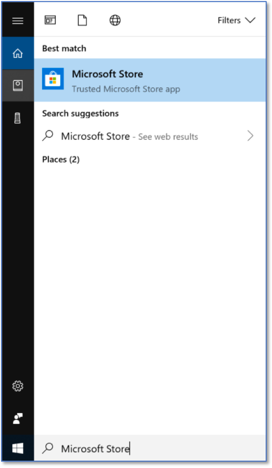
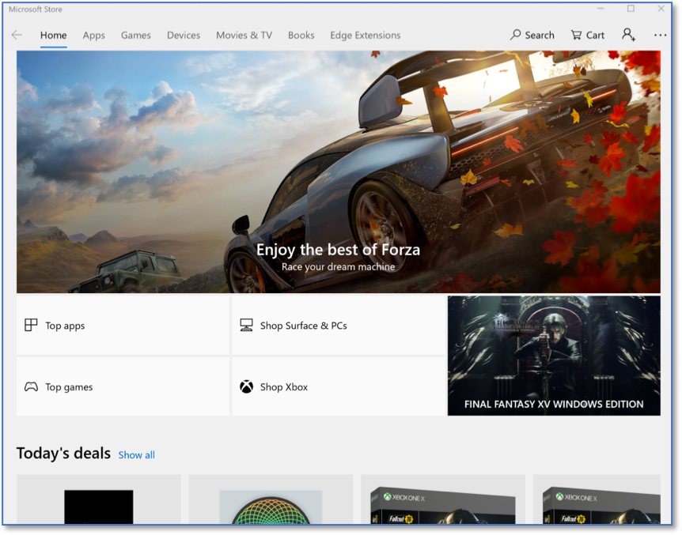
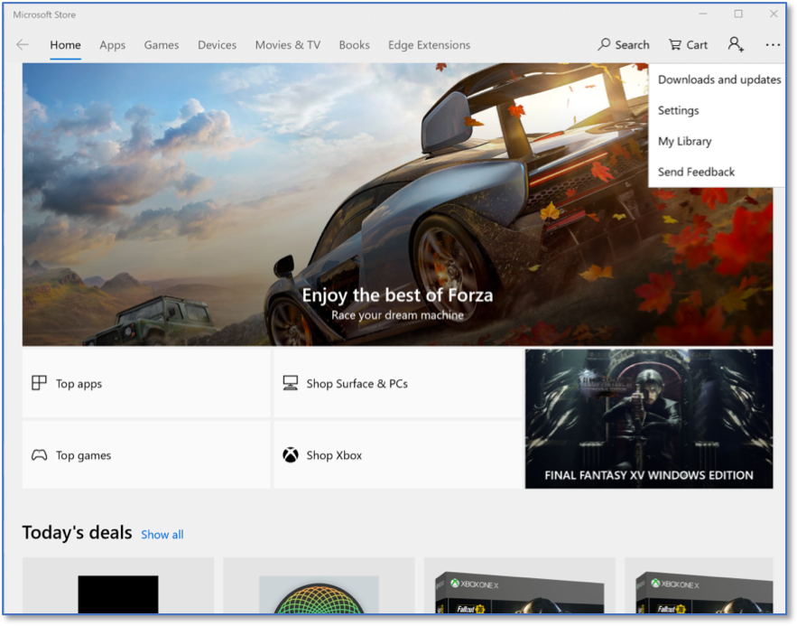
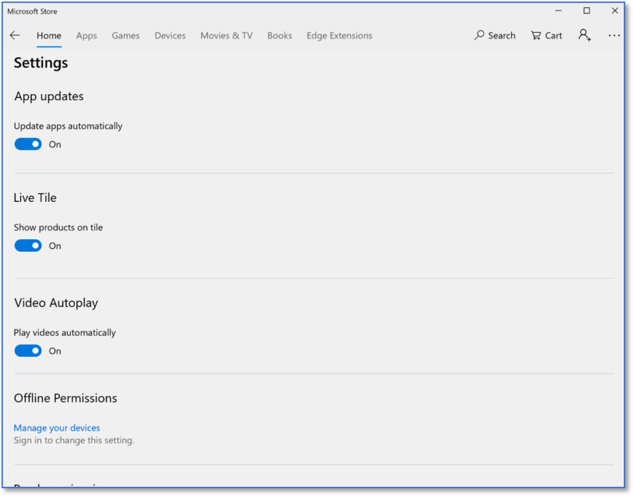
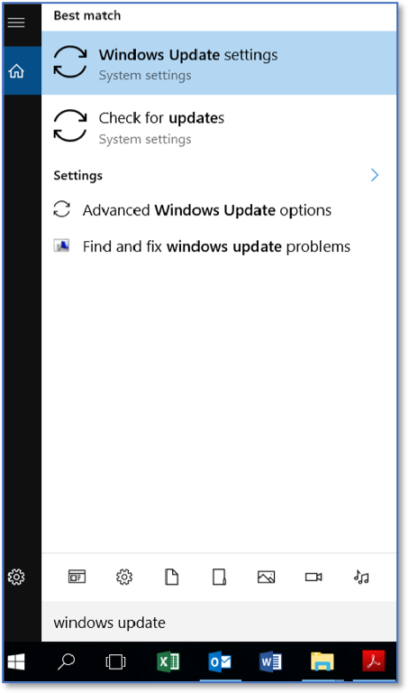
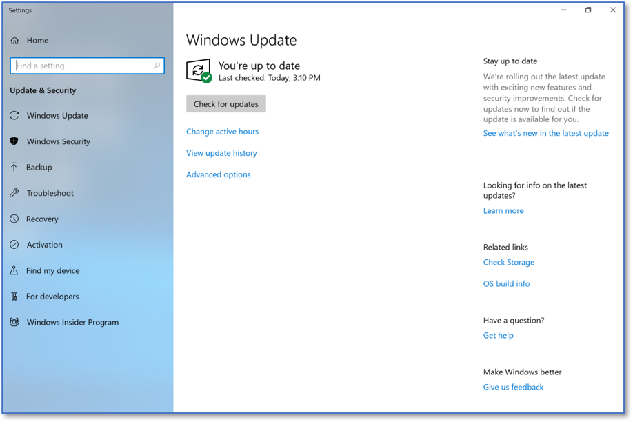
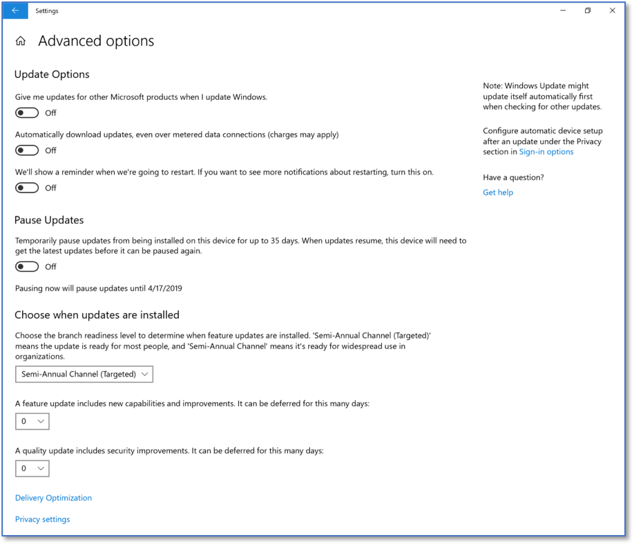
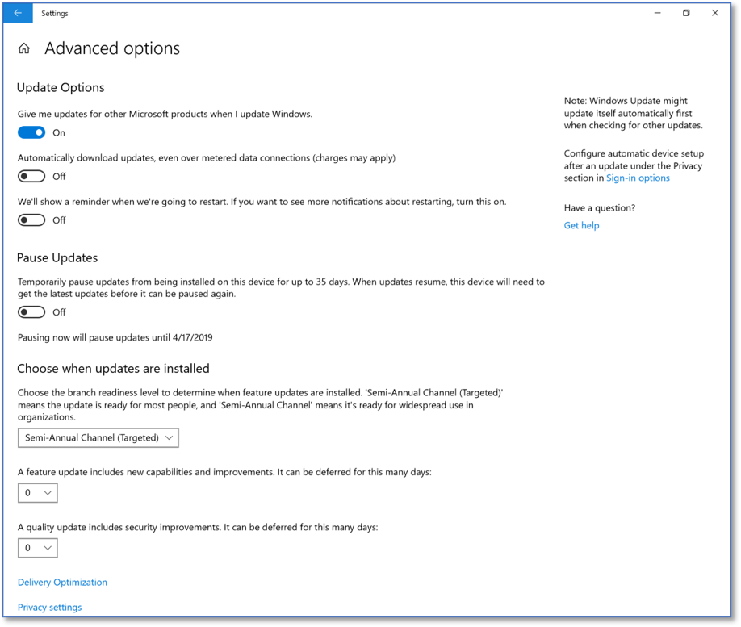

Automatic Application Updates via the Microsoft Application Store
==================================================================================
*Applies to Sub-Controls 3.5* 

In the Windows search bar with the magnifying glass icon, type Microsoft Store. 

   Searching for the Microsoft Store 
   
The Microsoft Store is shown below. Select the three dots *(. . .)* in the top right under the *X*. 

   Microsoft Store Home Screen
	
Select *Settings*.

   Available Settings in Microsoft Store
   
Ensure that *Update apps* automatically is set to *On*. 

   Detailed Settings in Microsoft Application Store
   
More steps are required to partially fulfill this Sub-Control. In the Windows search bar with the magnifying glass icon, type windows update. This is shown below. 

   Searching For Windows Update Settings
   
Select *Windows Update settings*. This will bring you to the Windows update panel. This screen shows the status of updates on this computer. Select *Advanced* options.    

   
   Windows Update Home Screen
   
Selecting *Advanced options* will provide additional system update settings shown here. 

   
   Windows Update Advanced Options 
   
Selecting *Give me updates for other Microsoft products when I update Windows* will automatically download updates for applications like Microsoft Word or Microsoft Excel. 

   
   Advanced Windows Update Options 
   
