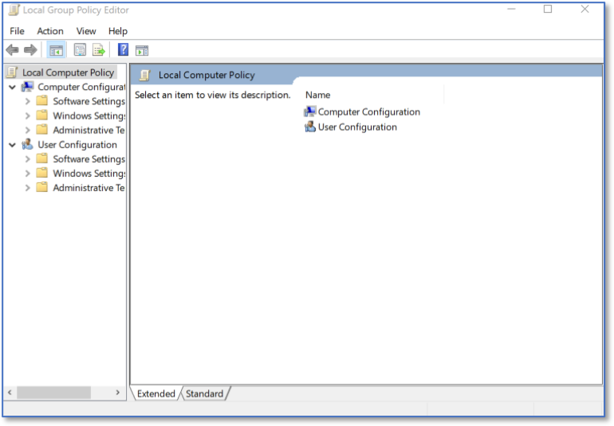

Automatically Locking a Workstation 
===================================
*Applies to Sub-Control 16.11* 

In the Windows search bar with the magnifying glass icon, type local group to open the Local Group Policy Editor. 

   Searching for LGPE 
   
The Local Group Policy Editor is shown below. 

   Local Group Policy Editor Home Screen 
   	
Select *Computer Configurations* and then *Windows Settings*. 

   LGPE Windows Settings 

Select *Security Settings* and then *Local Policies*. 

   LGPE Local Policies 

Select Security Options and then double click Interactive logon: Machine interactivity limit.

   Selecting Interactive Logon Settings 
	
The CIS Windows 10 Benchmark recommends 900 seconds or fewer. Choosing 600 seconds is 10 minutes. 

.. figure:: _static/InteractiveLogonSettings.png
   :align: center

   Interactive Logon Settings 