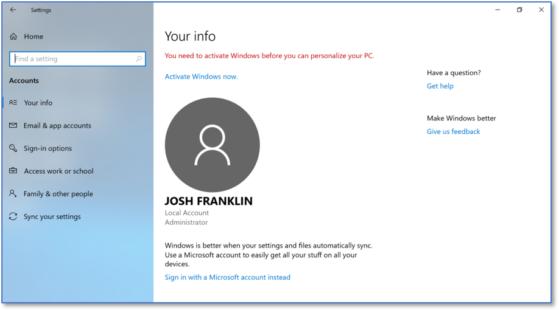
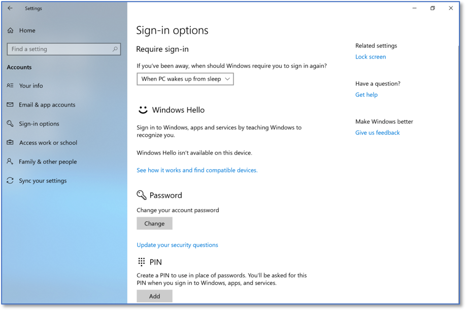
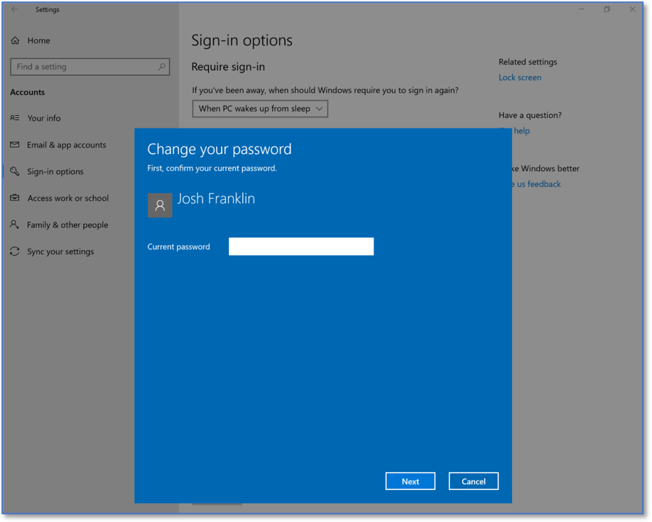

Changing the Default Password
=============================
*Applies to Sub-Controls 4.2* 

The best method of achieving this Sub-Control is via local group policy in the next section. Perform a search for *Settings*.

In the Windows search bar with the magnifying glass icon, type local group to open the Local Group Policy Editor. This is shown below:  

.. figure:: _static/SearchingForWindowsSettings.png
   :align: center

   Searching for Windows Settings
   
Select *Accounts*.  

.. figure:: _static/WindowsSettingsHomeScreen.png
   :align: center

   Windows Settings Home Screen
	
Select *Sign-in options*. 

   Windows Accounts Home Screen 
   
Select *Change your account password*. 

   Sign-in Options Home Screen 
   
Type the new password into the password field. 

.. note::

	Ensure the password is not a commonly used one. 

   Changing a Windows Password 