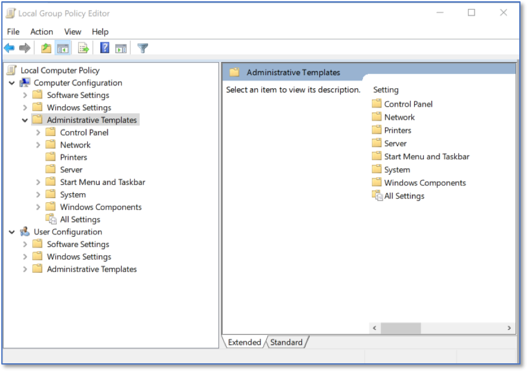

Configuring AutoPlay via LGPE 
=============================
*Applies to Sub-Control 8.5* 

.. note::

	The Local Group Policy Editor can be used to configure the Windows 10 AutoPlay settings in addition to Windows Control Panel. 

In the Windows search bar with the magnifying glass icon, type *local group* to open the Local Group Policy Editor. 

.. figure:: _static/SearchingForLGPE.png
   :align: center

   Searching for LGPE
   
The Local Group Policy Editor is shown below. 

.. figure:: _static/LocalGroupPolicyEditorHomeScreen.png
   :align: center

   LGPE Home Screen 
   	
Select *Computer Configuration* and expand *Administrative Templates*.

   LGPE Administrative Templates 

Select *Windows Components* and *AutoPlay Policies*.

   LGPE AutoPlay Policies

Select *Set the default behavior for AutoRun* and ensure that setting is *Disabled*.

   LGPE AutoRun Settings
   
Additionally, under *AutoPlay Policies*, Select *Turn off Autoplay*. 

   Turn Off AutPlay Settings
   
Set the value to *Enabled*. 

   Proper AutoPlay Configuration 