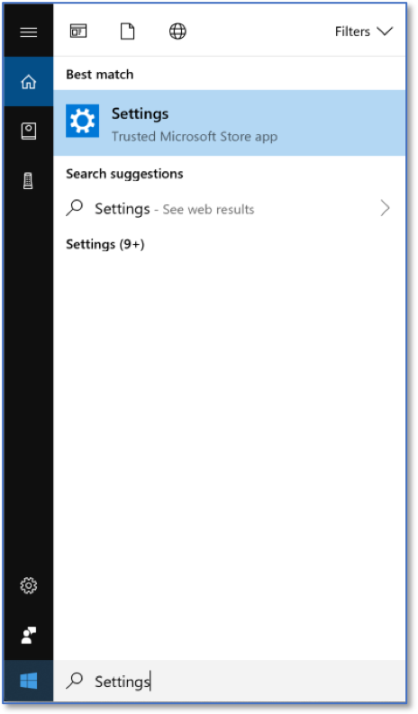
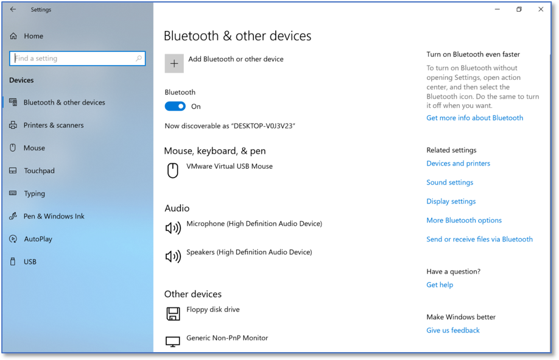

Configuring AutoPlay via Windows Control Panel
==============================================
*Applies to Sub-Control 8.5* 

Perform a search for *Settings*.

   Searching for Windows Settings
   
Select *Devices*. 

   Windows Settings Home Screen
	
Select *AutoPlay*. 

   Bluetooth & other devices Settings 

AutoPlay should be turned *off*.

   AutoPlay Settings
