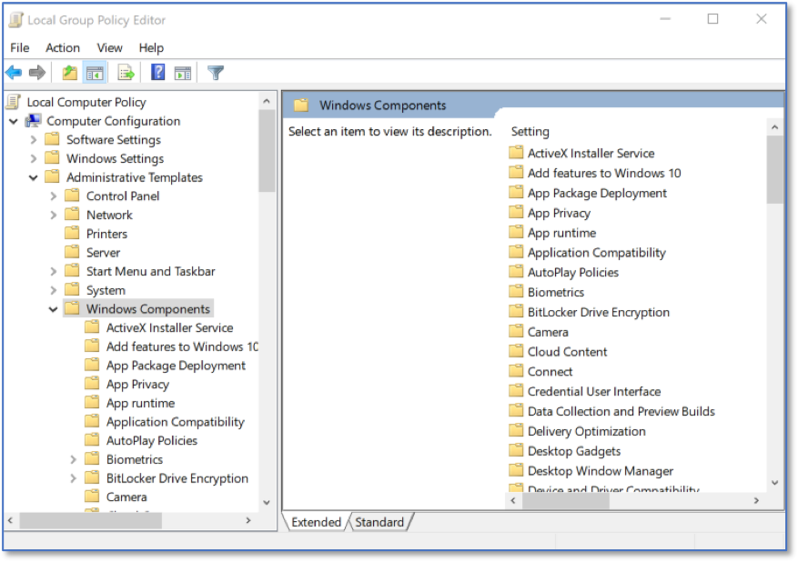
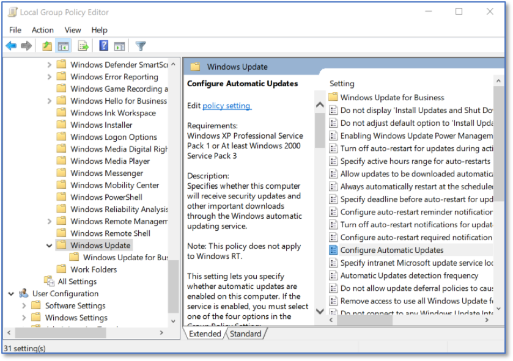
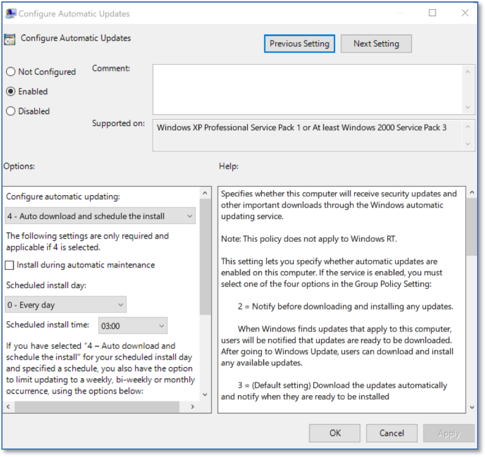

Configuring Automated Operating System Patch Management Tools via LGPE
==================================================================================
*Applies to Sub-Control 3.4* 

.. note::

   Local Group Policy Editor can be used to configure device settings for patching Windows 10 Pro. 

In the Windows search bar with the magnifying glass icon, type local group to open the Local Group Policy Editor. This is shown below:  

.. figure:: _static/SearchingForLocalGroupPolicyEditor.png
   :align: center

   Searching for Local Group Policy Editor 
   
The Local Group Policy Editor is show below. 

.. figure:: _static/LocalGroupPolicyEditorHomeScreen.png
   :align: center

   Local Group Policy Editor Home Screen
	
Under *Computer Configurations*, select *Administrative Templates*, and then *Windows Components*. 

   LGPE Windows Components
   
Select *Windows Update* and double click *Configure Automatic Updates*. 

   LGPE Windows Update Settings
   
Ensure that *Enabled* is selected, and Configure automatic updating is set to: *4 – Auto download and schedule the install*. Select *OK*.

   Autodownload Home Screen