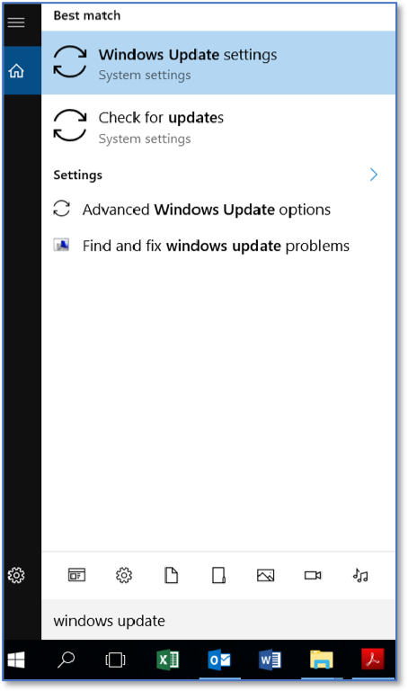

Configuring Automated Operating System Patch Management Tools via Windows Settings
==================================================================================
*Applies to Sub-Control 3.4* 

.. note::

	The local group policy method used in the next section is the preferred way of implementing this Sub-Control. 

In the Windows search bar with the magnifying glass icon, type *windows update*. This is shown below. 

   Searching for Windows Update Settings
   
Select *Windows Update settings*. This will bring you to the Windows update panel. This screen shows the status of updates on a computer. 

   Windows update status

.. note::

	Selecting Check for updates will automatically search for a system update. Selecting Advanced options will provide additional system update settings. 
	
Ensure that *Pause Updates* is set to *Off*.

   Advanced Update Options 
   
