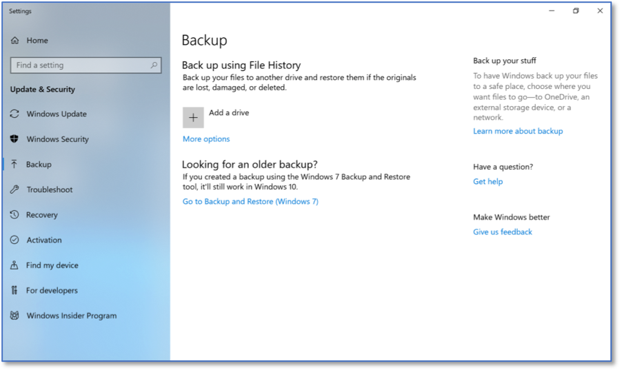

Configuring Microsoft File History
==================================
*Applies to Sub-Controls 10.1* 

Search for *backup* within the Windows search bar. 

.. figure:: _static/SearchingForWindowsBackupSettings.png
   :align: center

   Searching for Windows Backup Settings
   
The main backup screen within Windows 10 will be displayed. Select Add a drive under Back up using File History.

   Windows 10 Backup Settings
   	
The *Backup options home screen* will be presented. 

.. note::

	There must be an external hard drive or removable media (e.g., USB drive, thumb drive) connected to the computer to backup information onto. 

	File history backup options 

Scroll down and select *See advanced options*. 

   Advanced File History Options
   
Ensure File history in turned *on*. 

	Final File History Screen 

