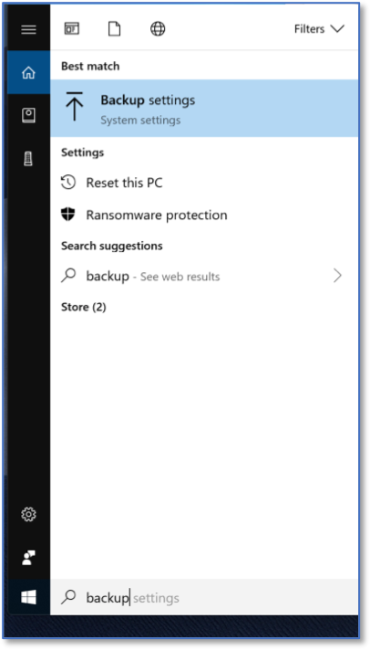
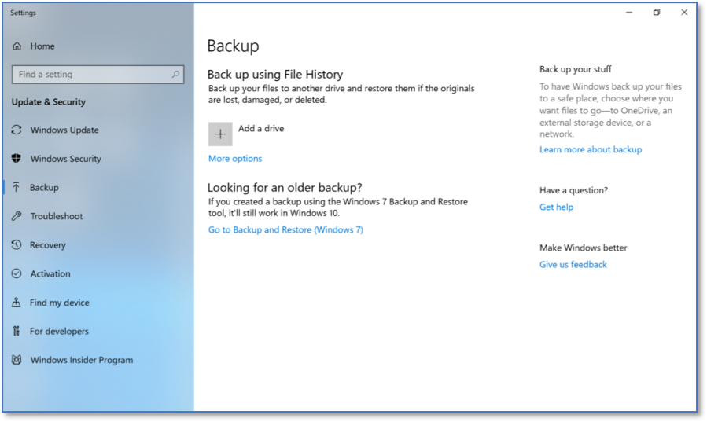
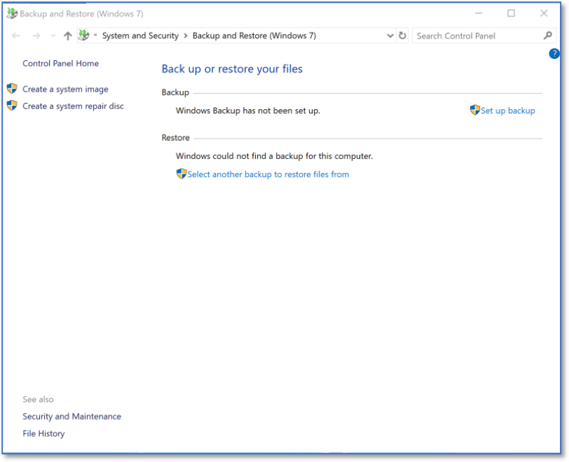
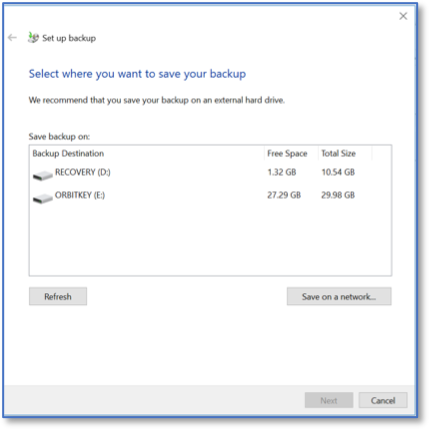
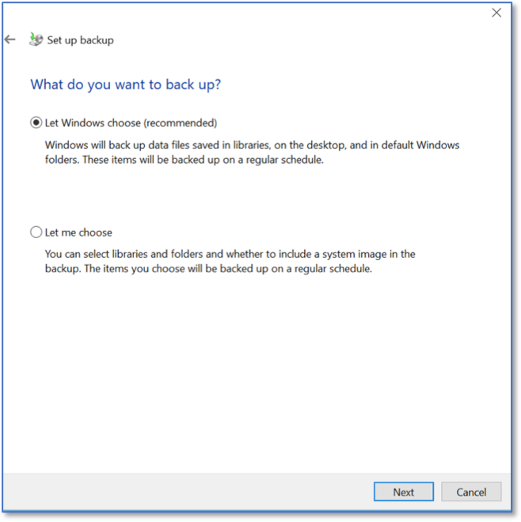
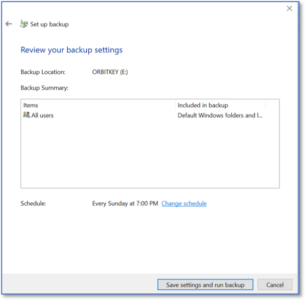
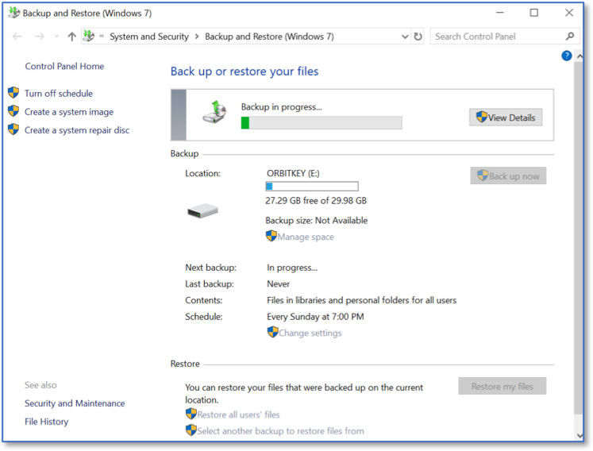

Creating System Images with Windows 10 Pro 
==========================================
*Applies to Sub-Controls 10.2* 

Search for *backup* within the Windows search bar. 

   Searching for Windows Backup Settings
   
The main backup screen within Windows 10 will be displayed. Select *Go to Backup and Restore (Windows 7)*.

   Windows 10 Backup Settings
   	
Select *Set up backup*.

	Backup and Restore Home Screen 

Select the local or network drive where backups should be stored. 

   Selecting the Storage Location for Backups
   
Choose whether Windows will select which files need to be backed up, or if this is a decision that needs to be made on a file by file basis. This example lets Windows select the files to be saved. 

	Choosing the Storage Location 

Select which accounts will be backed up. All accounts may be the most prudent option. 

	Selecting the Accounts that will be Backedup 
	
The backup will then begin. This may take a long amount of time to successfully complete. 

	Successful Backup 