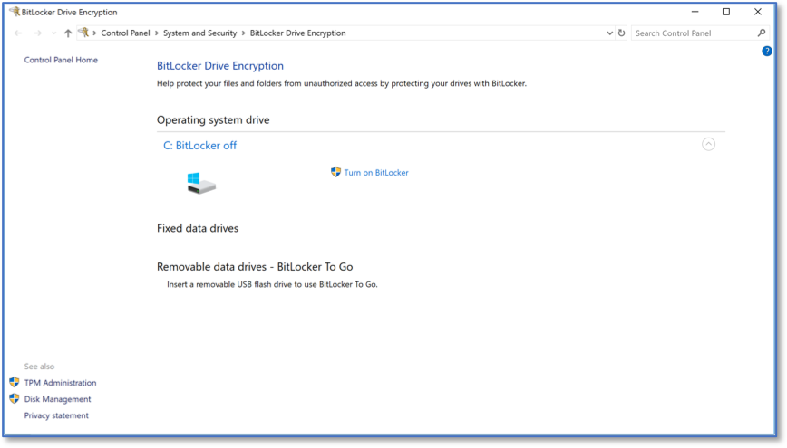

Enabling BitLocker
==================
*Applies to Sub-Control 10.4* 

.. note::

   BitLocker can be complicated to enable. In addition to this guidance, it may be useful to consult the Microsoft documentation (https://support.microsoft.com/en-us/help/4502379/windows-10-device-encryption). 

Search for *BitLocker* within the Windows search bar. Select *Manage BitLocker*.

   Searching for BitLocker
   
The primary *BitLocker Drive Encryption* screen within Windows 10 will be displayed. Select *Turn on BitLocker*.

   *Turn on Bitlocker* Setting

An error may be displayed if the computer in question lacks a hardware encryption module (e.g., Trusted Platform Module). TPMs are the preferred method to enable encryption on Windows 10 but encryption can be used without it. The following error will likely be presented. 

   Starting BitLocker Error Screen

In order to solve this issue, the Windows Local Group Policy Editor can be used. Follow this path to navigate to the correct LGPE settings. Select *Computer Configuration* and navigate the following: *Administrative Templates*, *Windows Components*, *BitLocker Drive Encryption*, *Fixed System Drives*, *Configure use of hardware-based encryption for fixed data drives*.

   Configure hardware-based encryption 

Enable this setting and then select *Use BitLocker software-based encryption when hardware encryption is not available*. 

   Configure Software-based Encryption 

Another setting must also be configured to resolve this error. Under *Computer Configuration*, select *Administrative Templates* and then *Windows Components*.

   Identifying Additional BitLocker Settings
   
Select *BitLocker Drive Encryption*, followed by *Operating System Drives*, and then select *Require additional authentication at startup*.

   Searching for BitLocker Startup Authentication Settings

Enable this setting and select *Allow BitLocker without a compatible TPM (requires a password or a startup key on a USB flash drive)*. This should solve the error, restart the steps in this section. 

   Requiring Additional Authentication at Startup Policy

The system in question will need to check additional settings before enabling BitLocker.

   Checking the System for BitLocker Support

The following screen will be presented. Select *Next*.

   BitLocker Setup 

Select *Next* after reviewing the warnings from Windows. 

   BitLocker Preparation Screen

Additional preparation for BitLocker. Wait until this process completes. 

   Additional BitLocker Preparation Screen 

Select *Next*. 

   Windows Recovery Warning 

This screen allows the user the option for how to unlock the encrypted drive at startup. This guide will use the *Enter a password* method.

   Unlock Selection Method 

A password is necessary to unlock BitLocker. Input a password. 

.. warning:: 

   If you forget the BitLocker password, you will be unable to unlock any computer with BitLocker enabled. All data on the system will be lost. Make a backup of the password and consider using a password manager.  

   BitLocker Password Creation 
   
A recovery key should be stored elsewhere if the BitLocker password is lost. Without the recovery key, if the password is forgotten then the system will be completely inaccessible.

   Recovery Key Selection

This guide encourages average users to select the faster option but for systems storing sensitive data, users are encouraged to encrypt the entire drive (the second option).

   Encryption Type Selection

Ensure *Run BitLocker system* check is selected. Select *Continue*.

   Run BitLocker System Check 

Select *New encryption mode (best for fixed drives on this device)*. 

   Choosing the Encryption Mode 

