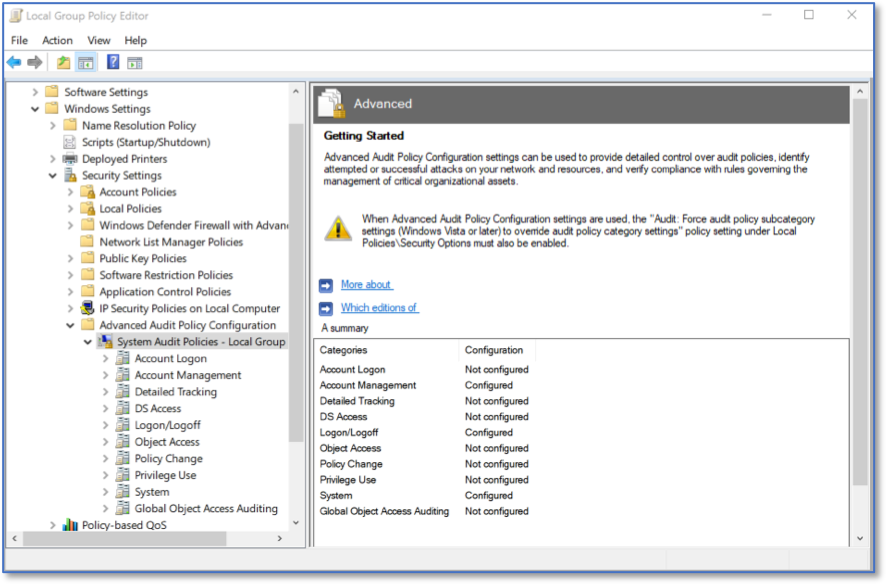
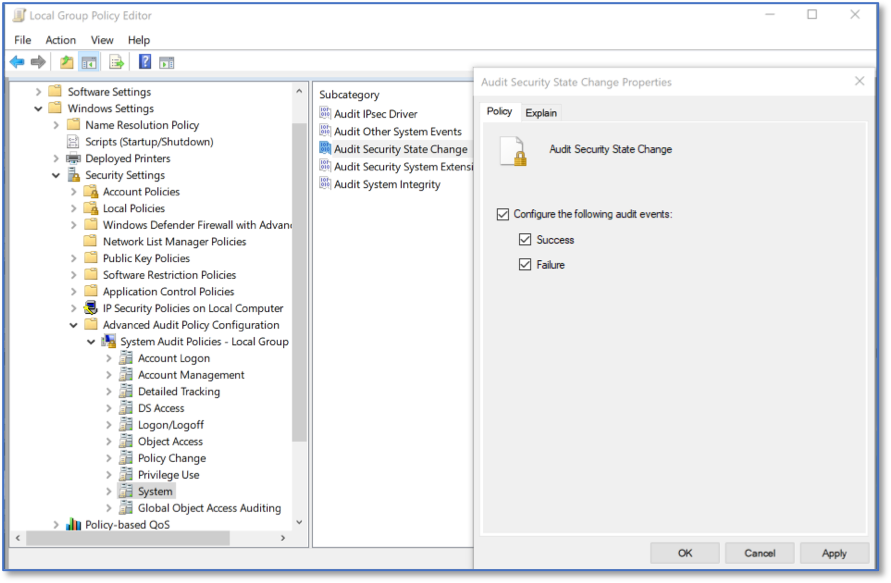

Enabling the System Event Audit Log 
==================================================================================
*Applies to Sub-Control 6.2* 

.. note::

   Enabling system logs on a Windows 10 system can be a complex task. There are hundreds of different types of logs that can all be enabled differently. This document shows one of many possible system event audit logs. For organizations looking for a solution balancing ease of use and security, CIS recommends organizations enable the following log types from Microsoft (https://docs.microsoft.com/en-us/windows-server/identity/ad-ds/plan/security-best-practices/audit-policy-recommendations). 

In the Windows search bar with the magnifying glass icon, type local group to open the Local Group Policy Editor. This is shown below:  

.. figure:: _static/SearchingForLocalGroupPolicyEditor.png
   :align: center

   Searching for Local Group Policy Editor 
   
The Local Group Policy Editor is show below. 

.. figure:: _static/LocalGroupPolicyEditorHomeScreen.png
   :align: center

   Local Group Policy Editor Home Screen
	
Under *Computer Configurations*, select *Security Settings*, and then *Advanced Audit Policy Configuration*. 

   Advanced Audit Policy Configuration

Expand *Advanced Audit Policy Configuration* to show *System Audit Policies - Local Group Policy Object*. Expand once more to show the audit policies. 

   System Audit Policies 

Under *Account Logon*, select *Audit Credential Validation*. Ensure that *Configure the following audit events* is checked, and that *Success* is checked. 

   Audit Credential Validation Policies  
   
Under *Account Management*, select *Audit Computer Account Management*. Ensure that *Configure the following audit events* is checked, and that *Success* is checked. 

   
   Audit Computer Account Management 

Under *Account Management*, select *Audit Other Account Management Events*. Ensure that *Configure the following audit events* is checked, and that *Success* is checked. 

   
   Audit Other Account Management Events  

Under *Account Management*, select *Audit Security Group Management*. Ensure that *Configure the following audit events* is checked, and that *Success* is checked. 

   
   Audit Security Group Management  

Under *Account Management*, select *Audit User Account Management*. Ensure that *Configure the following audit events* is checked, and that *Success* is checked. 

   
   Audit User Account Management   

Under *Detailed Tracking*, select *Audit Process Creation*. Ensure that *Configure the following audit events* is checked, and that *Success* is checked. 

   
   Audit Process Creation

Under *Logon/Logoff*, select *Audit Logoff*. Ensure that *Configure the following audit events* is checked, and that *Success* is checked. 

   
   Audit Logoff

Under *Logon/Logoff*, select *Audit Logon*. Ensure that *Configure the following audit events* is checked, and that *Success* is checked. Also ensure that *Failure* is checked.  

   
   Audit Logon
   
Under *Logon/Logoff*, select *Audit Special Logon*. Ensure that *Configure the following audit events* is checked, and that *Success* is checked. 

.. figure:: _static/AuditSpecialLogon.png
   :align: center
   
   Audit Special Logon

Under *Policy Change*, select *Audit Audit Policy Change*. Ensure that *Configure the following audit events* is checked, and that *Success* is checked. Also ensure that *Failure* is checked.  

   
   Audit Audit Policy Change

Under *Policy Change*, select *Audit Authentication Policy Change*. Ensure that *Configure the following audit events* is checked, and that *Success* is checked. 

   
   Audit Authentication Policy Change

Under *System*, select *Audit IPsec Driver*. Ensure that *Configure the following audit events* is checked, and that *Success* is checked. Also ensure that *Failure* is checked.  

   
   Audit IPsec Driver

Under *System*, select *Audit Security State Change*. Ensure that *Configure the following audit events* is checked, and that *Success* is checked. Also ensure that *Failure* is checked.  

   
   Audit Security State Change

Under *System*, select *Audit Security System Extension*. Ensure that *Configure the following audit events* is checked, and that *Success* is checked. Also ensure that *Failure* is checked.  

   
   Audit Security System Extension

Under *System*, select *Audit System Integrity*. Ensure that *Configure the following audit events* is checked, and that *Success* is checked. Also ensure that *Failure* is checked.  

   
   Audit System Integrity

.. note::

  Organizations interested in configuring a broader set of audit logs are encouraged to review the CIS Windows 10 Benchmark (https://www.cisecurity.org/benchmark/microsoft_windows_desktop/). 
