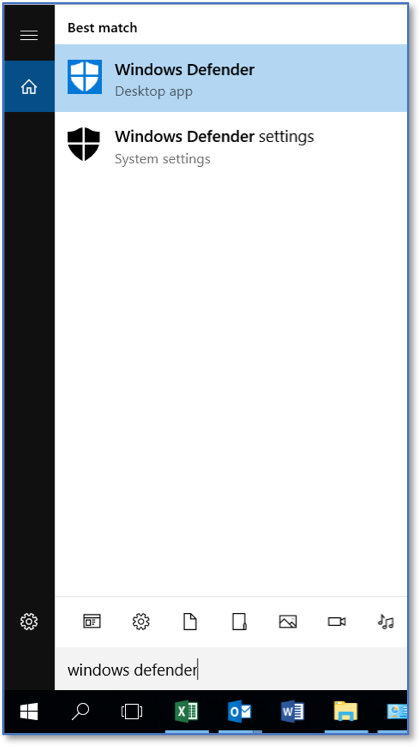
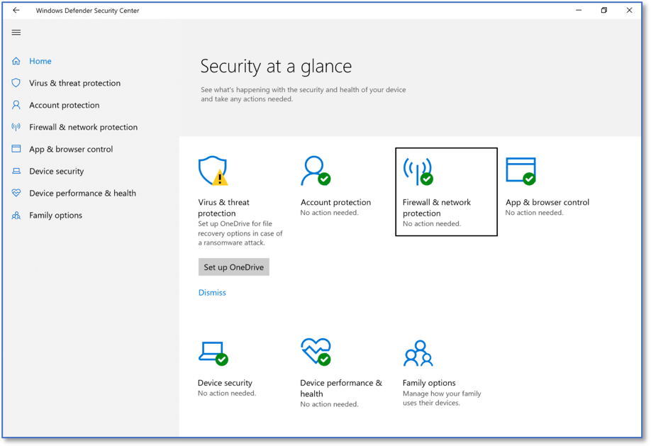
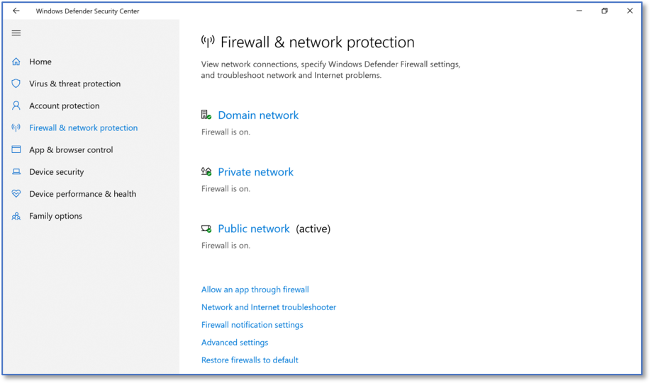
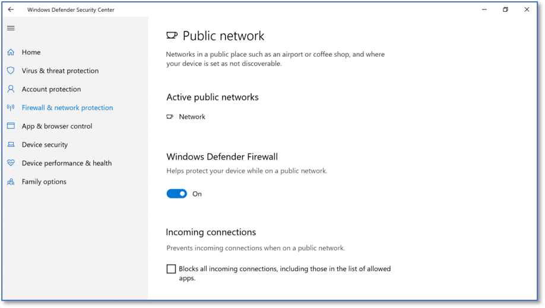

Enabling Windows Defender Firewall
===================================
*Applies to Sub-Control 9.4* 

Search for Windows Defender in the search bar. 

   Searching for Windows Defender 
   
Select Firewall & network protection. 

   Windows Defender Security Center Home Screen 
   	
Ensure that the Domain network, Private network, and Public network firewalls are set to *on*. 

   Firewall and Network Protection Settings

If one of the three firewalls are not set to on, select that firewall to enable it. 

   Windows Firewall Public Network Settings 

TODO Verify private network 