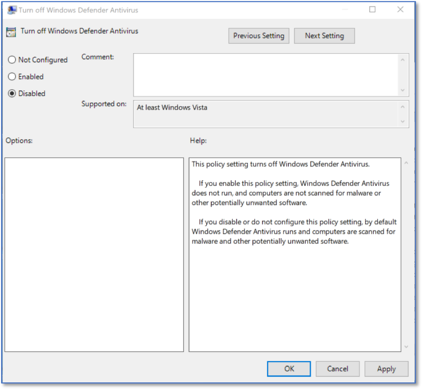
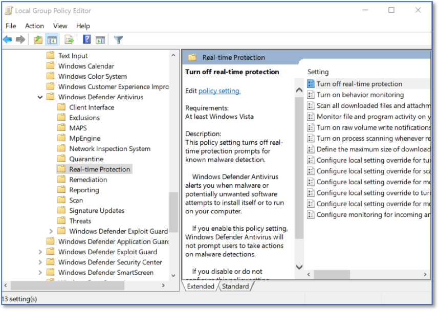

Enabling Windows Defender Security Center via LGPE 
==================================================================================
*Applies to Sub-Control 8.2* 

.. note::

	Windows Defender Antivirus is enabled by default, and this prevents it from being disabled by a user. 

In the Windows search bar with the magnifying glass icon, type local group to open the Local Group Policy Editor.

.. figure:: _static/SearchingForLocalGroupPolicyEditor.png
   :align: center

   Searching for Local Group Policy Editor 
   
The Local Group Policy Editor is show below. 

.. figure:: _static/LGPEHomeScreen.png
   :align: center

   LGPE Home Screen 
	
Select *Computer Configuration* and expand *Administrative Templates*.

.. figure:: _static/LGPEAdministrativeTemplates.png
   :align: center

   LGPE Administrative Templates 

Expand *Windows Components* and then *Windows Defender Antivirus*. 

.. figure:: _static/LGPEWindowsDefenderAntivirus.png
   :align: center

   LGPE Windows Defender Antivirus

Double click *Turn off Windows Defender Antivirus* and ensure *Disabled* is selected.

   LGPE Windows Defender Antivirus

Additional actions are required. Click the blue back arrow in the top left of the Local Group Policy Editor and select *Real-time Protection*, followed by *Turn off real-time protection*.

   LGPE Real-time Protection 
   
Ensure that *Turn off real-time protection* is *Disabled*. This prevents the application from being disabled. 

.. figure:: _static/Real-timeProtectionSettings.png
   :align: center

   Real-time Protection Settings 
   