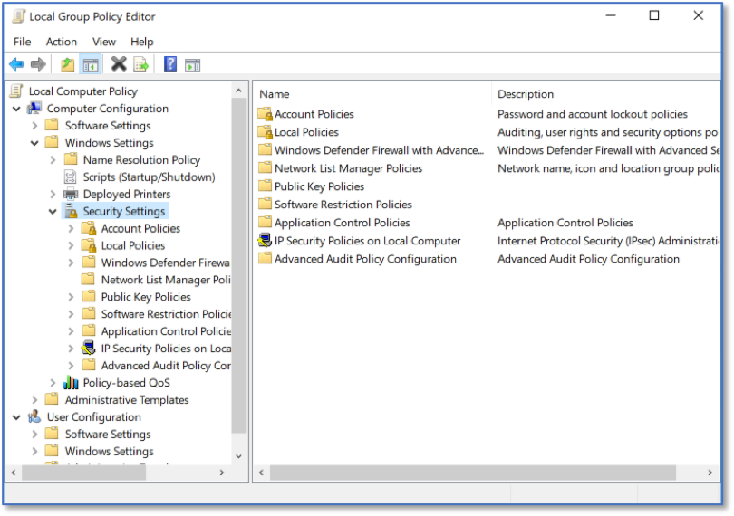
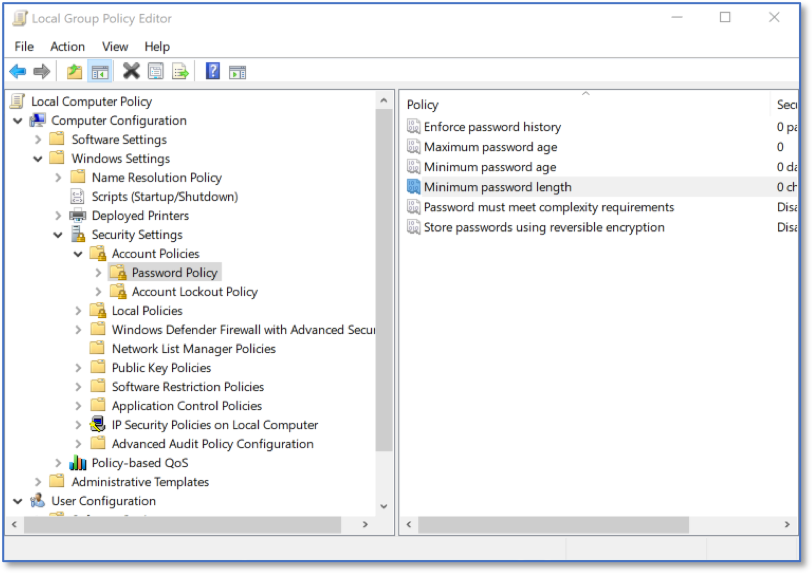
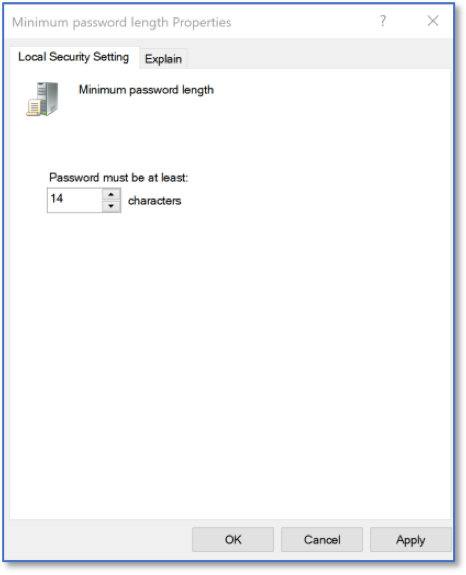

Enforcing Password Length via LGPE
==================================================================================
*Applies to Sub-Control 4.2* 

.. note::

	The Local Group Policy Editor can be used to enforce a minimum password length. The CIS Windows 10 Benchmark recommends a 14-character password. 

In the Windows search bar with the magnifying glass icon, type local group to open the Local Group Policy Editor. This is shown below. 

.. figure:: _static/SearchingForLGPE.png
   :align: center

   Searching for LGPE
   
The Local Group Policy Editor is shown below. 

.. figure:: _static/LocalGroupPolicyEditorHomeScreen.png
   :align: center

   Local Group Policy Editor Home Screen
	
Under *Computer Configuration*, expand *Windows Settings* and select *Security Settings*. 

   LGPE Security Settings 
   
Select *Account Policies*, then *Password Policy* and then *Minimum password length*. 

   LGPE Minimum Password Length 
   
Input 14 as the minimum password length and select *Apply*. 

.. note::
	This will not automatically make a user change their password to meet policy. Users will need to manually update their password, but Windows will ensure that future passwords are at least 14 characters long.

   Selecting Minimum Password Length