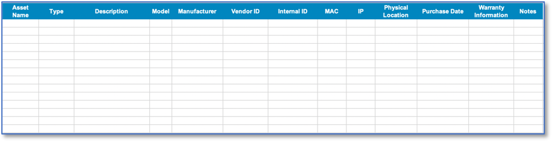

Hardware Asset Tracking Spreadsheet 
==================================================
Elements of a Hardware Asset Tracking Spreadsheet can include the following: 

* Asset Name: Colloquial name of the asset 
* Type: The type of the asset (e.g., workstation, firewall, router)
* Description: A description of the asset  
* Model: The model of the asset 
* Manufacturer: The organization that created the asset
* Internal ID: Any identifier used internally to name a manufacturer 
* MAC: The MAC address of the asset
* IP: The IP address of the asset, but this may change over time.
* Physical Location: The location within enterprise the asset is located, may be N/A for virtual or cloud-based systems 
* Purchase Date: The date the asset was acquired by the organization. 
* Warranty Information: Any relevant warranty information needed for the manufacturer 
* Other Notes: Other notes as needed: 

