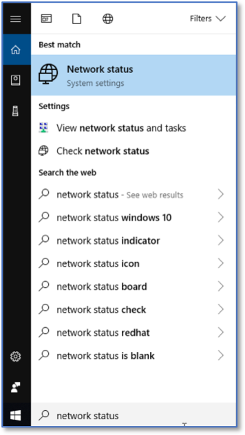
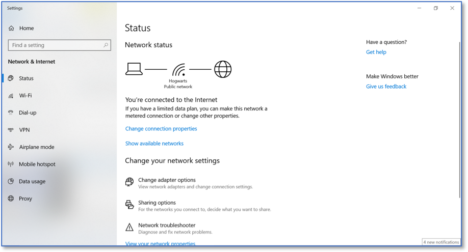
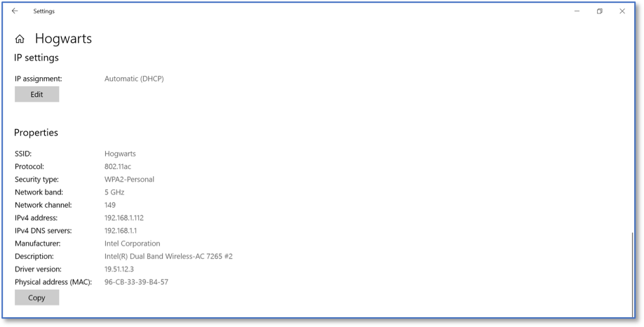

Identifying if a WiFi Connection is Using AES 
=============================================
*Applies to Sub-Controls 15.7* 

Search for network within the Windows search bar. 

   Searching for Windows Network Status 
   
Select *Change connection properties*.

   Windows Network Status 
   	
The following network connection screen will be shown. 

.. figure:: _static/InformationAboutASpecificNetwork.png
   :align: center

	Information About a Specific Network 

If *WPA2* is listed under *Security type* then AES is being used to secure this wireless connection.

	Identifying AES on Local Wifi 

