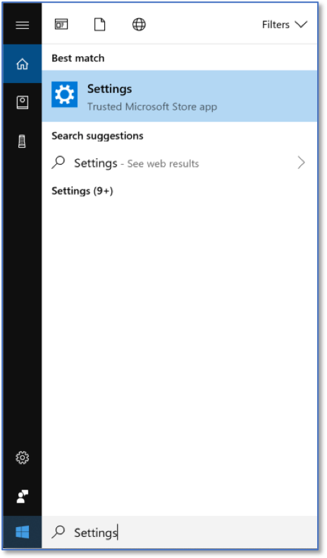
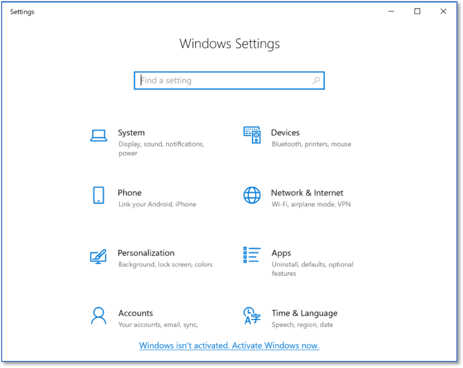
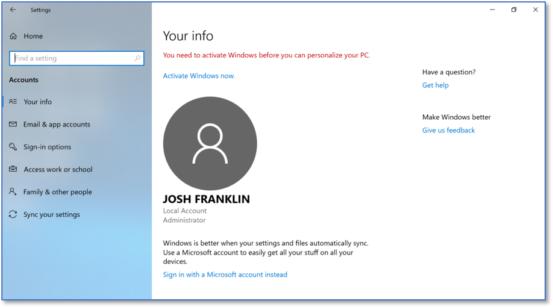

Identifying if an Account is an Administrator 
==================================================================================
*Applies to Sub-Controls 4.3* 

Perform a search for *Settings*.

   Searching for Windows Settings
   
Select *Accounts*.  

   Windows Settings Home Screen
	
Accounts that have administrative access will say *Administrator* under the username. 

   Account Home Screen 
   