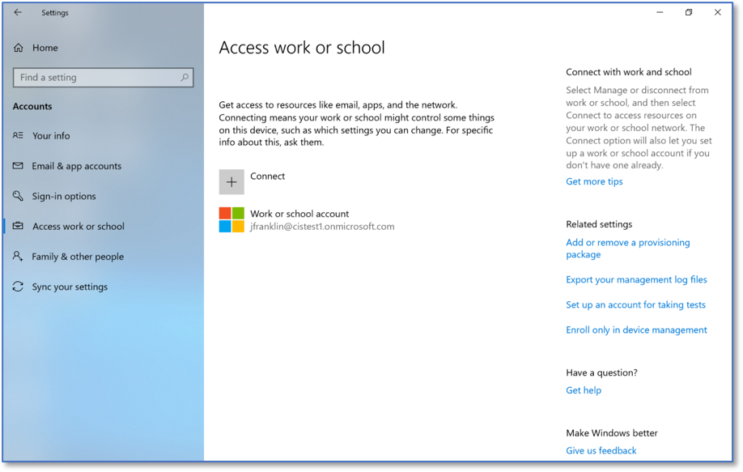
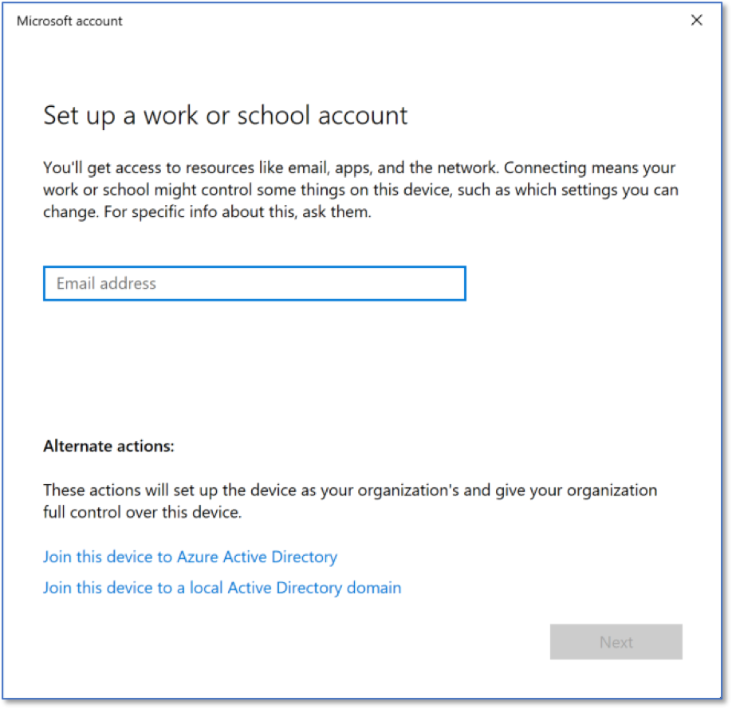

Joining a Windows 10 System to a Domain 
==================================================
*How to Join a Windows 10 Pro machine to an O365 Domain* 

Perform a search for *Settings*.

.. figure:: _static/SearchingForSettings.png
   :align: center

   Searching for Settings.
   
Select *Accounts* and then *Access work or school*.

.. figure:: _static/WindowsSettingsHomeScreen.png
   :align: center

   Windows Settings Home Screen.

Select *Connect*. 

   Access Work or School
   
Enter an email address and password to connect to the domain. 

   Adding a System to a Domain 
   

   
