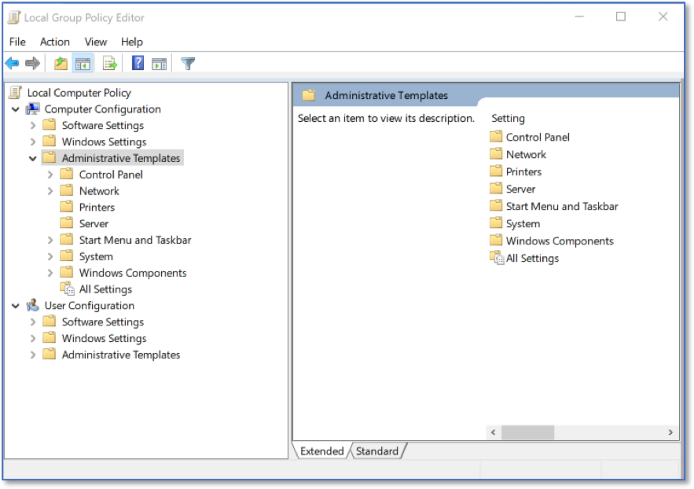
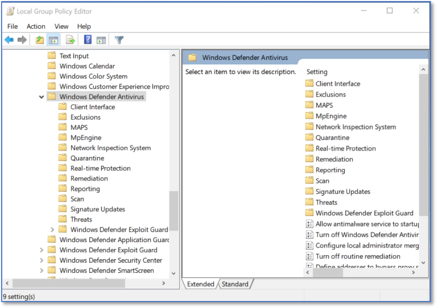
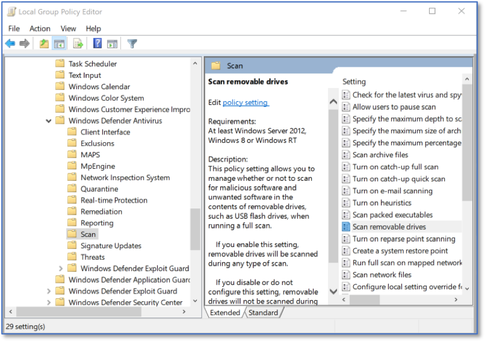
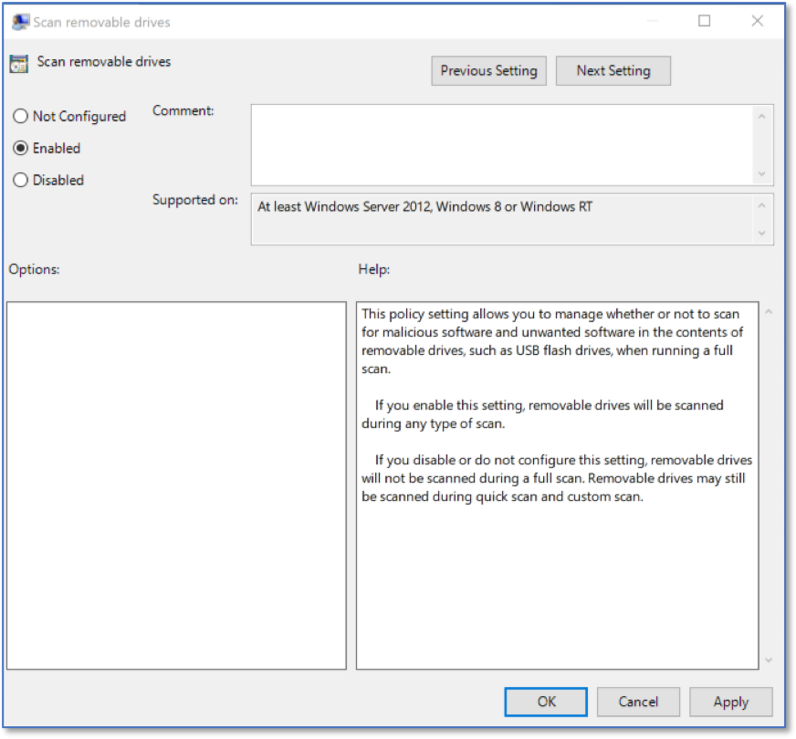
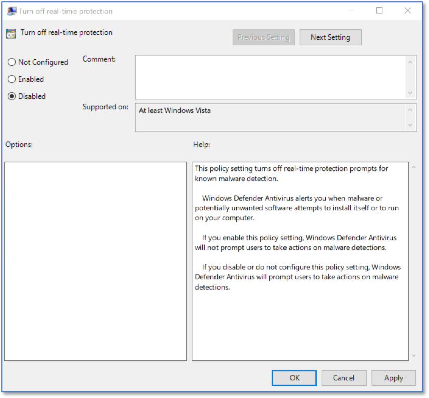

Scanning Removable Devices via LGPE 
===================================
*Applies to Sub-Control 8.4* 

In the Windows search bar with the magnifying glass icon, type local group to open the Local Group Policy Editor.

.. figure:: _static/SearchingForLocalGroupPolicyEditor.png
   :align: center

   Searching for Local Group Policy Editor 
   
The Local Group Policy Editor is show below. 

.. figure:: _static/LGPEHomeScreen.png
   :align: center

   LGPE Home Screen 
	
Select *Computer Configuration* and expand *Administrative Templates*.

   LGPE Administrative Templates 

Expand *Windows Components* and then *Windows Defender Antivirus*. 

   LGPE Windows Defender Antivirus

Select *Scan* and double click *Scan removable drives*. 

   LGPE Windows Defender Antivirus Scan

Ensure this setting is set to *Enabled*. 

.. note::
	
	Note that this will not automatically scan any inserted device. Instead, if a Windows Defender Antivirus scan is run while a removable drive is inserted, that drive will also be within scope of the scan.

   Windows Antivirus Scan Settings  
   
Ensure that *Turn off real-time protection* is *Disabled*. This prevents the application from being disabled. 

   Real-time Protection Settings 
   