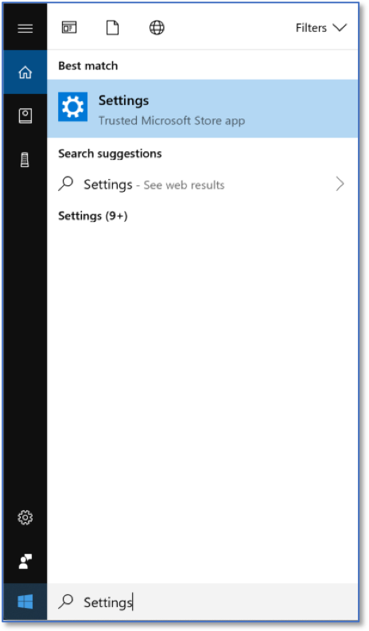
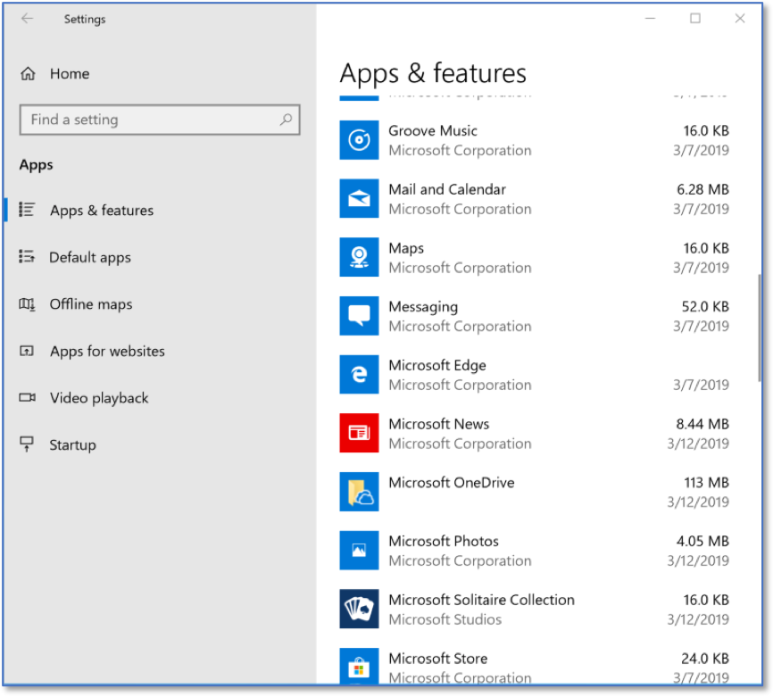
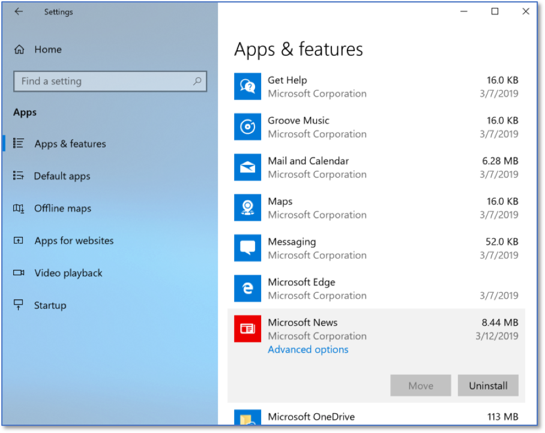
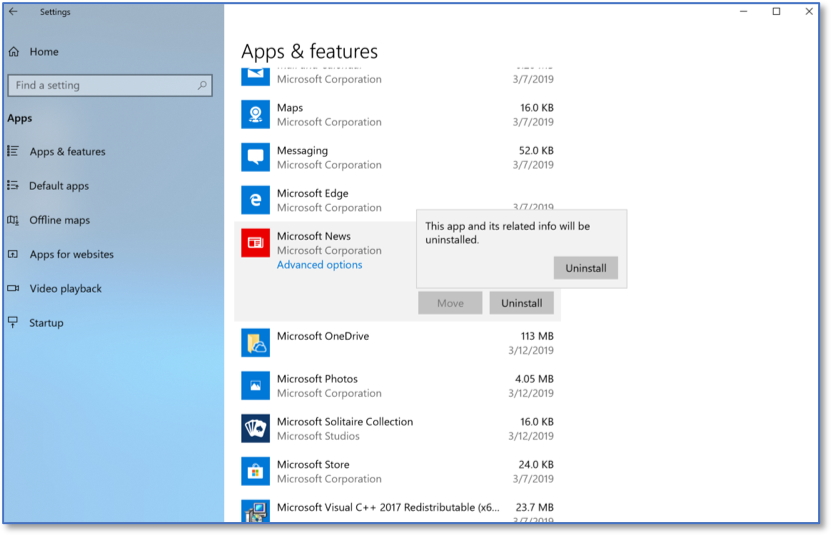

Uninstalling Software 
======================
*Applies to Sub-Controls 2.6* 

Perform a search for *Settings*.

   Searching for Settings.
   
Select *Apps*.

.. figure:: _static/WindowsSettingsHomeScreen.png
   :align: center

   Windows Settings Home Screen.

All of the installed applications on the Windows 10 machine are available here. Select the application that should be uninstalled. Note that some of the listed apps cannot be uninstalled. 

   Listing of Installed Applications 
   
Select *Uninstall*. 

   Selected Installed Application 
   
Select *Uninstall* another time to confirm.

   Uninstalling An Application 
   

   
