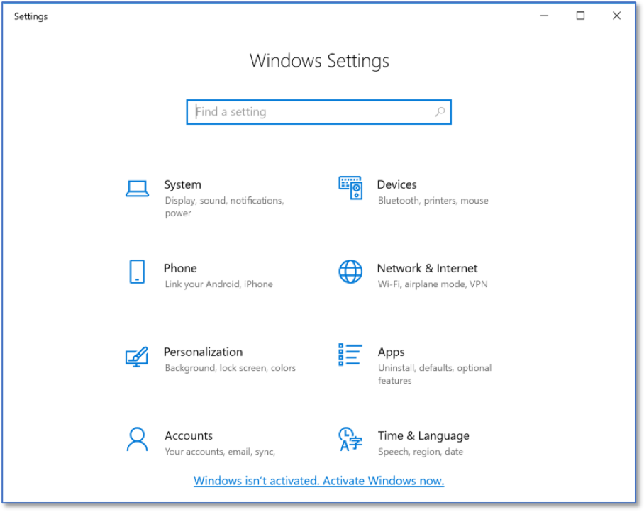

Viewing Accounts on a Windows 10 System
=======================================
*Applies to Sub-Control 16.8* 

Perform a search for *Settings*.

.. figure:: _static/SearchingForWindowsSettings.png
   :align: center

   Searching for Windows Settings
   
Select *Accounts*. 

   Windows Settings Home Screen 
   	
Select *Family & other people*.

   Individual Account Home Screen 

Other accounts on the computer are sometimes viewable on this screen. If the user viewing this display is not an administrator, they may not be able to see all of the accounts on the system. 

   Identifying Other Accounts on Windows

