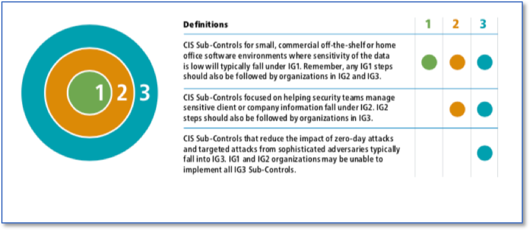
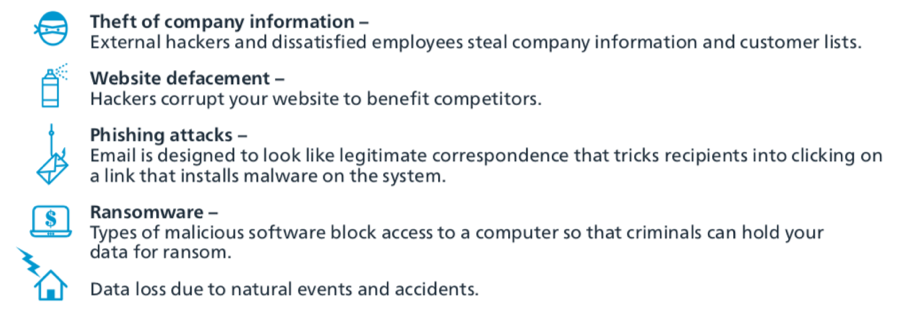

Introduction 
================================
The CIS Controls are a prioritized set of actions that collectively form a defense-in-depth set of best practices that mitigate the most common attacks against systems and networks. The CIS Controls are developed by a community of Information Technology (IT) experts who apply their first-hand experience as cyber defenders to create these globally accepted security best practices. The experts who develop the CIS Controls come from a wide range of sectors including, retail, manufacturing, healthcare, education, government, defense, and others. So, while the CIS Controls address the general practices that most organizations should take to secure their systems, some operational environments may present unique requirements not addressed by the CIS Controls. 

We are at a fascinating point in the evolution of what we now call cyber defense. To help us understand the cyber threat, we have seen the emergence of threat information feeds, reports, tools, alert services, standards, and threat-sharing frameworks. To top it all off, we are surrounded by security requirements, risk management frameworks, compliance regimes, regulatory mandates, and so forth. There is no shortage of information available to security practitioners on what they should do to secure their infrastructure. But all of this technology, information, and oversight has become a veritable “Fog of More” – competing options, priorities, opinions, and claims that can paralyze or distract an enterprise from vital action. Business complexity is growing, dependencies are expanding, users are becoming more mobile, and the threats are evolving. New technology brings us great benefits, but it also means that our data and applications are distributed across multiple locations, many of which are not within our organization’s infrastructure. 
 
==================
Purpose 
==================
Credit card breaches, identity theft, ransomware, theft of intellectual property, loss of privacy, denial of service – these cyber incidents have become everyday news. Victims include some of the largest, best-funded, and most security-savvy enterprises: government agencies, major retailers, financial services companies, even security solution vendors. Many of the victims have millions of dollars to allocate for cybersecurity, yet still fall short in their efforts to defend against common attacks. What is even more disturbing is that many of the attacks could have been prevented by well-known security practices such as regular patching and secure configurations. 

What are the rest of us supposed to do? How do organizations with small budgets and limited resources respond to the continuing cyber problem? This guide seeks to empower the owners of small and medium-sized enterprises (SMEs) to protect their businesses with a small number of high priority actions based on the Center for Internet Security’s Critical Security Controls (CIS Controls). Historically the CIS Controls utilized the order of the Controls as a means of focusing an organization’s cybersecurity activities, resulting in a subset of the first six CIS Controls referred to as cyber hygiene. However, many of the practices found within the CIS cyber hygiene control set can be difficult for organizations with limited resources to implement. This highlighted a need for a collection of best practices focused on balancing resource constraints and effective risk mitigation. As a result, CIS is proposing the following guidance to prioritize CIS Control utilization, known as CIS Implementation Groups (IGs).

**Group 1**

A Group 1 organization is small to medium-sized with limited IT and cybersecurity expertise to dedicate towards protecting IT assets and personnel. The principal concern of these organizations is to keep the business operational as they have a limited tolerance for downtime. The sensitivity of the data that they are trying to protect is low and principally surrounds employee and financial information. However, there may be some small to medium-sized organizations that are responsible for protecting sensitive data and, therefore, will fall into a higher Group. Sub-Controls selected for Group 1 should be implementable with limited cybersecurity expertise and aimed to thwart general, non-targeted attacks. These Sub-Controls will also typical be designed to work in conjunction with small or home office Commercial-off-the-Shelf (COTS) hardware and software.

**Group 2**

A Group 2 organization employees individuals responsible for managing and protecting IT infrastructure. These organizations support multiple departments with different risk profiles based on job function and mission. Small organizational units may have regular compliance burdens. Group 2 organizations often store and process sensitive client or company information and can withstand short interruptions of service. A major concern is loss of public confidence if a breach occurs. Sub-Controls selected for Group 2 help security teams cope with increased operational complexity. Some Sub-Control will depend on enterprise-grade technology and specialized expertise to properly install and configure. 

**Group 3**

A Group 3 organization employees security experts that specialize in the difference facts of cybersecurity (e.g., risk management, penetration testing, application security). Group 3 systems and data contain sensitive information or functions that are subject to regulatory and compliance oversight. A Group 3 organization must address availability of services and the confidentiality and integrity of sensitive data. Successful attacks can cause significant harm to the public welfare. Sub-Controls selected for Group 3 must abate targeted attacks from a sophisticated adversary and reduce the impact of zero-day attacks. 

While this approach provides generalized guidance for prioritizing usage of the CIS Controls, this should not replace an organization’s need to understand their own organizational risk posture. Organizations should still seek to conduct their own duty of care analysis and tailor their implementation of the CIS controls based on what is appropriate and reasonable given their resources, mission, and risks. Using these types of methods, such as those described in CIS RAM, organizations of different Implementation Groups can make risk-information decisions about which Sub-Controls in their Group they may not want to implement and which higher Group’s they should strive for. The intention is to help organization focus their efforts based on the resources they have available and integrate into any pre-existing risk management process. 

The IGs are self-assessed organizational categories based on relevant cybersecurity attributes. Each IG identifies a subset of the CIS Controls that the community has broadly assessed to be reasonable for an organization with a similar risk profile and resources to strive to implement. These IGs represent a horizontal cut across the CIS Controls tailored to that type of enterprise, where each IG builds upon the previous one. Accordingly, an organization implementing the Sub-Controls defined for their IG is moving towards a standard duty of care as described in the CIS Risk Assessment Method (CIS RAM).

This guide provides detailed information on how to accomplish each of the Sub-Controls within IG1. This guide builds upon the best practices established via the CIS Controls V7.1. Where possible, the document provides step-by-step guidance on how organizations utilizing the Microsoft Windows operating system and supporting platforms can meet applicable Sub-Controls. 

==================
Audience 
==================
As this document is meant to help individuals and organizations comply with the set of cybersecurity protections detailed within the first IG1. The primary audience for this guide is IT contractors for small- to medium-sized businesses, although it is beneficial to anyone concerned about the following security threats: 

==================
Assumption
==================
A set of assumptions were identified when developing this guidance: 

* Individuals and organizations using this guidance lack large cybersecurity-focused professionals within their organizations.
* The systems being safeguarded may not be domain-joined, meaning that there is not a central location from which to deploy policy.
* The organization likely has few to zero servers.
* The organization likely uses some cloud services to provide key pieces of infrastructure, such as email.
* The IT environment is fairly static, and does not change much over time. 

==================
Document Structure
==================
The presentation of each Sub-Control in this document includes the following elements: 

* Category: Some Sub-Controls require the implementation or configuration of technology, and are labeled as Technical. Other Sub-Controls can be implemented via procedural or manual means and are labeled as Procedural. Depending on how they are implemented, some Sub-Controls can be both.
* Purpose: A description of the importance of the Sub-Control in blocking or identifying presence of attacks and an explanation of how attackers actively exploit the absence of this control. It helps to answer the question of Why is this important? Purpose also describes the types of threats that can be mitigated by implementing this Sub-Control. Phishing, ransomware, or cybersecurity accidents are examples of threats that would be included within this element. 
* Automation: When Sub-Controls are automated, they are implemented in a more consistent manner without the introduction of human error. The degree of difficulty of implementation is often a factor discussed here. 
* Guidance and Tools: This section provides additional information for implementing the Sub-Control, alongside pointers to external guidance documents. Free and open source tools for accomplishing a given Sub-Control can also be found here. 

The Appendix of this document includes the following sections.

* Acronyms and References: This section contains commonly used acronyms and abbreviations alongside references mentioned throughout the document.
* Step-by-Step Instructions: Many of the Sub-Controls contain step-by-step instructions for putting the cybersecurity control in place. 

============================
Relevant Microsoft Products 
============================

This guide is focused on implementing Windows products for the applicable Sub-Controls. Microsoft creates a variety of products such as: 

* Microsoft Windows 10 Home 
* Microsoft Windows 10 Pro 
* Microsoft Windows Server 
* Microsoft Office 365 (O365) 

Microsoft Windows 10 Home and Windows 10 Pro are both separate editions of Microsoft’s Windows 10 operating system. Microsoft provides a useful guide to the differences between these two editions of Windows at the following link (https://www.microsoft.com/en-us/windows/compare). Windows 10 Pro will be the primary edition of the Windows 10 operating system discussed within this document. Windows Home provides the basics most users need to accomplish everyday tasks, such as writing documents, manipulating spreadsheets, and browsing the Internet. It is also not meant for commercial usage. But most businesses need more in order to get their job done, and accordingly, Windows 10 Pro is designed to fill that niche. 
 
Two common primary enterprise needs include management and security. Windows 10 Pro allows an organization to join a system to a domain. This means that a sever or domain controller will be able to remotely distribute policy and configuration settings from a single centralized system. These policies allow an enterprise to manage how their employees can use their computer system, such as locking their systems after a period of inactivity. Deploying policies are an extremely powerful enterprise feature that can also activate enterprise class security mitigations that may otherwise not be used. For instance, Windows 10 Pro contacts BitLocker, which is Microsoft’s full disk encryption system. BitLocker can also encrypt any Universal Serial Bus (USB) and other extra drives.

Office 365 is Microsoft’s subscription-based cloud offering that includes an entire suite of Microsoft’s web-based applications. This includes standard business applications like Word, Excel, and Outlook. Office 365 also includes the Office 365 Admin Center, which provides access to Azure Active Directory. This feature allows an enterprise to join Windows 10 Pro systems to a cloud-based domain. This provides many, but not all, of the security and management benefits of using a domain controller without needing to setup an instance of Microsoft Server on premises.

==============================
CIS Controls Assessment Module 
==============================
The CIS Controls Assessment Module (CAM) is designed to help organizations measure their implementation of the CIS Controls. CAM functions as a module within CIS-CAT Assessor v4 and can be run much like other assessments, making it compatible with existing CIS-CAT functionality including remote assessments and the CIS-CAT Pro Dashboard. The first version of CAM covers IG1 in Windows 10 environments, providing a combination of automated checks and survey questions to cover the 43 IG1 Sub-Controls.  For the more procedural Sub-Controls, CAM allows users to save yes/no answers documenting their implementation of those Sub-Controls at the organizational level.  For Sub-Controls that are conducive to automation, specific settings in the environment are checked to generate a machine-specific pass or fail for that Sub-Control.

Although it is the goal of CIS for a Windows 10 system configured with this Windows 10 Implementation Guide to pass a CAM assessment, there are subtle differences for a subset of CIS Sub-Controls. CAM currently checks for the set of CIS Sub-Controls listed below with the differences between Sub-Control assessment methodologies between this Windows 10 Implementation Guide and CAM.
    
.. csv-table:: Comparison of Features 
   :file: _static/CAM-Win10-Guide-Comparison.csv
   :header-rows: 1

   
